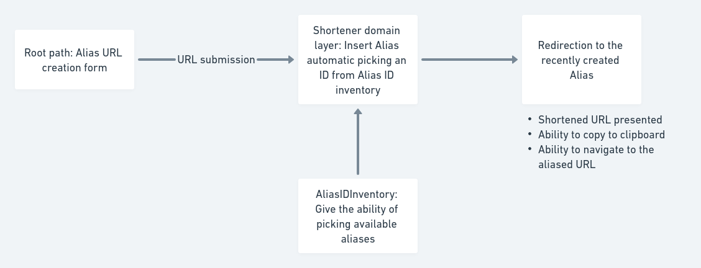

# Alias Creation

## Implementation overview

## How to use

1. [Access the root page](http://localhost:4000/)
2. Type or paste any valid URI schema in the form.
3. Click on Short it button.
4. You should be redirected to the Alias created.
5. Copy the Alias or just access it.

## Notes

1. You can pass an optional ID to the insert function. That enables ID customization.
2. The Alias ID inventory implementation takes a random ID. It doesn't check inventory. A more robust implementation should rely on a previous created inventory with allocation constraints.
